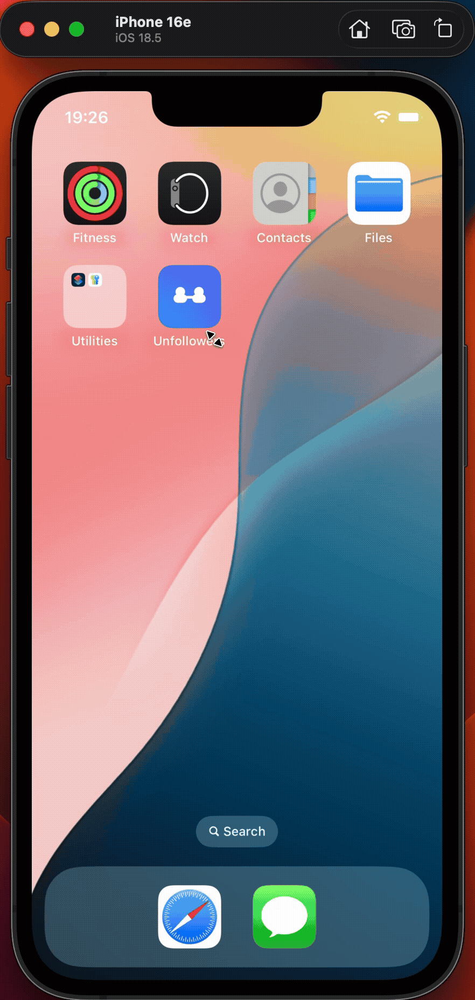

[](https://github.com/celikhakan41/Unfollowers/actions/workflows/ci.yml)

# Unfollowers

A privacy-first iOS app for analyzing Instagram exports.
No login. No tracking. Fully offline.

Your data never leaves your device.

## Demo
<p align="center"></p>

## Table of Contents
- [Demo](#demo)
- [Why Unfollowers?](#why-unfollowers)
- [Features](#features)
- [Privacy & Security](#privacy--security)
- [How to Use](#how-to-use)
- [Getting Instagram Export](#getting-instagram-export)
- [Developer Documentation](#developer-documentation)
  - [Overview](#overview)
  - [Requirements](#requirements)
  - [Getting Started](#getting-started)
  - [Simulator & UDID](#simulator--udid)
  - [Project Structure](#project-structure)
  - [Tests](#tests)
  - [Scripts](#scripts)
  - [Version Control Hygiene](#version-control-hygiene)
  - [CI / Automation Notes](#ci--automation-notes)
  - [Troubleshooting](#troubleshooting)

## Why Unfollowers?
Many unfollower tools require account login or send data to external servers. Unfollowers analyzes your official Instagram data export locally on your Mac—offline, with no account access and no network requests.

## Features
- File picker to import your Instagram export (ZIP)
- Three analysis modes via segmented control:
  - Active Following (last 180 days)
  - Active Following (last 365 days)
  - All Following (historical)
- Works fully offline; no login, no network usage
- English and Turkish localization

## Privacy & Security
- No login or account access
- No network usage; runs offline
- No analytics or tracking
- All analysis happens locally on your device

## How to Use
1. Request your Instagram data export in JSON (see below).
2. Open the app on your Mac and select the exported ZIP via the file picker.
3. Choose an analysis mode and review the results.

## Getting Instagram Export
1. In Instagram, go to Settings → Privacy and security (web) or Your activity (mobile).
2. Select “Download your information” (or “Download data”).
3. Request JSON format and choose a date range.
4. When you receive the email, download the ZIP to your Mac.

---

## Developer Documentation

### Overview
This repository follows a clean, reproducible iOS project layout with Makefile-driven commands and CI-friendly conventions. All build outputs, logs, and machine-specific files are excluded via `.gitignore`.

### Requirements
- macOS with Xcode (15 or newer recommended)
- iOS Simulator runtime (installed with Xcode)
- Internet access to resolve Swift Package Manager dependencies

### Getting Started
The following commands are provided via the Makefile:

```bash
# Build (includes fetching SPM dependencies)
make build

# Run unit tests
make test

# Build + install to simulator + launch
make

# Clean (including DerivedData/.build)
make clean

# List available simulators (find UDIDs)
make list-sims
```

Notes:
- `make test` and `make` will attempt to boot a simulator. If your UDID/destination is different, update it (see below).
- SPM dependencies cannot be resolved without internet access.

### Simulator & UDID
Key Makefile variables:

- `SCHEME`: Unfollowers
- `SIM_UDID`: UDID of the target simulator for running tests and the app
- `DESTINATION`: `platform=iOS Simulator,id=$(SIM_UDID)`

Find UDID and override temporarily:

```bash
make list-sims
# Copy the UDID of a suitable device
SIM_UDID=<UDID> make test
```

To make it permanent, update `SIM_UDID` in the `Makefile`.

### Project Structure
```text
Unfollowers/
├─ Unfollowers.xcodeproj/
│  ├─ project.pbxproj
│  ├─ project.xcworkspace/
│  └─ xcshareddata/
├─ Unfollowers/
│  ├─ Assets.xcassets/
│  ├─ Localization/
│  ├─ Resources/
│  ├─ UnfollowersApp.swift
│  ├─ ContentView.swift
│  ├─ DocumentPicker.swift
│  ├─ ShareSheet.swift
│  └─ InstagramJSONParser.swift
├─ UnfollowersTests/
│  ├─ UnfollowersTests.swift
│  ├─ InstagramJSONParserGoldenTests.swift
│  ├─ InstagramJSONParserRobustnessTests.swift
│  ├─ InstagramJSONParserPerformanceTests.swift
│  └─ Fixtures/
│     ├─ Senaryo A.zip
│     ├─ Senaryo B.zip
│     ├─ Senaryo C.zip
│     └─ instagram_export_test_all0_appformat_fixed.zip
│     └─ Invalid.zip
├─ UnfollowersUITests/
│  ├─ UnfollowersUITests.swift
│  └─ UnfollowersUITestsLaunchTests.swift
├─ Unfollowers.xctestplan
├─ scripts/
│  └─ generate_appicon.swift
├─ Makefile
├─ AGENTS.md
├─ CODING_RULES.md
└─ .gitignore
```

> Note: Build outputs (`.build/`, `DerivedData/`), temporary folders, and logs are not included in the repository; they are excluded via `.gitignore`.

### Tests
- Unit and UI tests are executed via the Xcode test plan (`Unfollowers.xctestplan`).
- Test fixtures (ZIP archives) live under `UnfollowersTests/Fixtures/`.
- Added robustness tests and fixtures:
  - `Invalid.zip` (plain text renamed to `.zip`) validates failure on non-ZIP input.
  - Additional ZIP variants for missing files are generated in-test using ZIPFoundation to keep fixtures tiny and deterministic.
- Run:
  ```bash
  make test
  ```

UI testing tips:
- Deterministic fixtures can be fed to the app via a launch argument, e.g.:
  - `--ui-test-zip fixture:standard`
- To keep overlays predictable during UI tests, set the environment variable `UI_TESTING=1` to disable auto-opening the Help sheet on certain errors.
- Stable accessibility identifiers used by tests include: `mode_all`, `mode_180`, `mode_365`, `helpSheet`, `helpCloseButton`, `errorMessageBox`, `analysisCompleteLabel`, `resultsList`, `resultRow_<username>`.

### Scripts
- `scripts/generate_appicon.swift`: Generates a 1024x1024 example app icon and writes it to `Unfollowers/Assets.xcassets/AppIcon.appiconset/`.
  ```bash
  swift scripts/generate_appicon.swift
  ```

### Version Control Hygiene
Never commit the following (with reasons):
- Build/derived outputs: `.build/`, `DerivedData/`, `*.xcarchive`, `*.xcresult` — machine-specific and reproducible on CI.
- Logs/temporary files: `.logs/`, `.tmp/`, `*.log`, `*.exit` — noisy and non-deterministic.
- Xcode user data: `xcuserdata/`, `*.xcuserstate` — developer-specific settings causing unnecessary diffs.
- OS/IDE cruft: `.DS_Store`, `.idea/`, `.vscode/` — unrelated to the build.

See the root `.gitignore` for the full list.

### CI / Automation Notes
- Use a macOS runner (e.g., GitHub Actions).
- Steps: Install Xcode → optionally cache SPM → `make build` → `make test`.
- Shared schemes under `xcshareddata/` are included in version control for CI.

### Troubleshooting
- "Could not resolve package dependencies": SPM requires internet access to fetch packages. Verify network in local/CI environments.
- "Unable to find application named 'Simulator'": The CLI cannot access the Simulator app. Ensure Xcode Command Line Tools and iOS Simulator components are installed; use `make list-sims` to verify devices and update `SIM_UDID`.
- UDID-related issues: Use `make list-sims` to find a suitable device, try `SIM_UDID=<UDID> make test`, or update the `Makefile`.

Additional docs: add screenshots under `docs/images/` (see `docs/images/README.md`).
